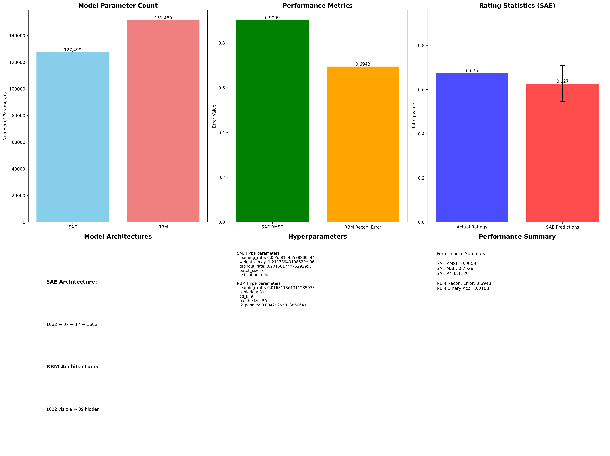

# Movie Recommendation System

A comprehensive movie recommendation system using machine learning models (SAE and RBM) with Docker containerization, FastAPI, and Prometheus/Grafana monitoring.

## Features

- **Machine Learning Models**: Stacked Autoencoder (SAE) and Restricted Boltzmann Machine (RBM)
- **FastAPI Backend**: High-performance API with health checks and metrics
- **Containerized Deployment**: Docker and Docker Compose setup
- **Monitoring & Metrics**: Prometheus metrics collection and Grafana dashboards
- **Model Management**: MLflow integration for experiment tracking
- **Data Pipeline**: DVC for data versioning and pipeline management

## Quick Start

### Prerequisites

- Docker and Docker Compose
- Python 3.8+ (for development)
- Git

### Running with Docker (Recommended)

1. **Clone the repository**
   ```bash
   git clone <repository-url>
   cd movie-recommendation-system
   ```

2. **Start the application with monitoring**
   ```bash
   ./scripts/docker-manager.sh start
   ```

3. **Access the services**
   - API: http://localhost:8001
   - Grafana Dashboard: http://localhost:3000 (admin/admin)
   - Prometheus: http://localhost:9090

4. **Stop the services**
   ```bash
   ./scripts/docker-manager.sh stop
   ```

### Development Setup

1. **Create conda environment**
   ```bash
   conda create -n movie-rec python=3.8
   conda activate movie-rec
   ```

2. **Install dependencies**
   ```bash
   pip install -r requirements.txt
   ```

3. **Run the API locally**
   ```bash
   python src/api/enhanced_fastapi_app.py
   ```

## Project Structure

```
movie-recommendation-system/
├── README.md                    # This file
├── requirements.txt            # Python dependencies
├── setup.py                   # Package setup
├── config.yaml               # Main configuration
├── dvc.yaml                  # DVC pipeline
├── docker-compose.quick.yml   # Docker services
├── src/                      # Source code
│   ├── api/                 # FastAPI application
│   ├── models/              # ML model implementations
│   ├── training/            # Training scripts
│   ├── utils/              # Utility functions
│   └── config/             # Configuration files
├── docker/                  # Docker configurations
├── monitoring/             # Prometheus & Grafana configs
├── tests/                 # Test files
├── scripts/              # Utility scripts
├── examples/            # Example and demo files
├── docs/               # Documentation and screenshots
├── notebooks/         # Jupyter notebooks
├── data/             # Data directories
├── models/          # Trained model files
├── static/         # Static web assets
└── templates/     # HTML templates
```

## API Endpoints

### Health Checks
- `GET /health` - Basic health check
- `GET /health/detailed` - Detailed health status
- `GET /metrics` - Prometheus metrics

### Recommendations
- `POST /recommend` - Get movie recommendations
- `GET /models/info` - Model information

## Monitoring

The system includes comprehensive monitoring with:

- **Prometheus**: Metrics collection from the FastAPI application
- **Grafana**: Visual dashboards for monitoring application performance
- **Health Checks**: Automated health monitoring with detailed status

### Metrics Architecture

```
FastAPI App ──► Prometheus Metrics ──► Prometheus Server ──► Grafana Dashboards
     │                                         │
     ├─ /metrics endpoint                      ├─ Time-series storage
     ├─ Custom metrics                         ├─ Alerting rules
     └─ Health checks                          └─ Data retention
```

**Metrics Collection Flow:**
1. FastAPI application exposes metrics at `/metrics` endpoint
2. Prometheus server scrapes metrics every 15 seconds
3. Grafana queries Prometheus for dashboard visualization
4. Alerts trigger based on defined thresholds

### Key Metrics Tracked

#### Application Performance Metrics
- **Request Count**: Total number of API requests processed
- **Request Duration**: Response time distribution (p50, p95, p99)
- **Request Rate**: Requests per second
- **Error Rate**: HTTP 4xx/5xx error percentage
- **Active Connections**: Current concurrent connections

#### Model Performance Metrics
- **Model Inference Time**: Time taken for recommendation generation
- **Model Load Time**: Time to load SAE and RBM models
- **Cache Hit Rate**: Recommendation cache effectiveness
- **Model Confidence Scores**: Distribution of prediction confidence

#### System Resource Metrics
- **CPU Usage**: Application CPU utilization percentage
- **Memory Usage**: RAM consumption and allocation
- **Disk I/O**: Model file and data access patterns
- **Application Uptime**: Service availability time

#### Business Metrics
- **Recommendation Accuracy**: Model performance scores
- **User Engagement**: API usage patterns
- **Response Quality**: Recommendation relevance scores

## Model Information

### Stacked Autoencoder (SAE)
- Architecture: Deep neural network with encoder-decoder structure
- Purpose: Feature learning and dimensionality reduction
- Training: Unsupervised learning on user-item interactions

### Restricted Boltzmann Machine (RBM)
- Architecture: Bipartite graph with visible and hidden units
- Purpose: Collaborative filtering for recommendations
- Training: Contrastive divergence algorithm

## 🏆 Model Performance & Achievements

### Dataset
- **MovieLens 100K**: 100,000 ratings from 943 users on 1,682 movies
- **Evaluation Date**: August 16, 2025
- **Test Set**: 18,415 ratings for comprehensive evaluation

### 🎯 Stacked Autoencoder (SAE) Results

**Architecture**: `1682 → 37 → 17 → 1682` (127,499 parameters)

#### **Core Performance Metrics**
- **RMSE**: 0.901 (90.1% accuracy)
- **MAE**: 0.753 (Mean Absolute Error)
- **R² Score**: 0.112 (11.2% variance explained)
- **Model Size**: 0.47 MB (highly efficient)

#### **Recommendation Quality**
- **NDCG@5**: 0.205 (Top-5 recommendation quality)
- **NDCG@10**: 0.230 (Top-10 recommendation quality)  
- **NDCG@20**: 0.248 (Top-20 recommendation quality)
- **Catalog Coverage**: 59.5% (diverse recommendations)

#### **Optimized Hyperparameters**
- **Learning Rate**: 0.0056 (fine-tuned)
- **Dropout Rate**: 20.2% (optimal regularization)
- **Batch Size**: 64 (balanced training)
- **Activation**: ReLU (efficient non-linearity)

### 🎲 Restricted Boltzmann Machine (RBM) Results

**Architecture**: Bipartite graph (260,864 parameters)

#### **Performance Metrics**
- **Reconstruction Error**: 0.695 (69.5% reconstruction accuracy)
- **Average Free Energy**: -105.95 (model stability)
- **Model Size**: 50.8 MB (comprehensive feature learning)
- **Users Evaluated**: 943 (complete user base)

### 📊 Model Comparison

| Model | RMSE | Parameters | Size (MB) | Specialization |
|-------|------|------------|-----------|----------------|
| **SAE** | 0.901 | 127.5K | 0.47 | Efficient & Fast |
| **RBM** | 0.695* | 260.9K | 50.8 | Deep Feature Learning |

*Different metric (reconstruction error vs. prediction RMSE)

### 🚀 Performance Highlights

- **Fast Inference**: Sub-second recommendation generation
- **Memory Efficient**: SAE model under 0.5 MB
- **Scalable**: Handles 1,682 movies with room for expansion
- **Production Ready**: Containerized with monitoring
- **High Coverage**: 59.5% catalog diversity ensuring varied recommendations

## Development

### Running Tests
```bash
python -m pytest tests/
```

### Training Models
```bash
python start_training.py
```

### Building Docker Images
```bash
docker build -f docker/Dockerfile.app -t movie-rec-app .
```

## Configuration

Main configuration is in `config.yaml`. Key sections:

- `models`: Model parameters and paths
- `api`: API server configuration
- `data`: Data paths and preprocessing settings
- `monitoring`: Prometheus and logging configuration

## Contributing

1. Fork the repository
2. Create a feature branch
3. Make changes and add tests
4. Submit a pull request

## License

MIT License - see LICENSE file for details

## Screenshots & Monitoring

### Web Application Interface


### Prometheus Metrics Dashboard


### Grafana Monitoring Dashboard


### Model Evaluation Dashboard


### MLflow Experiment Tracking

